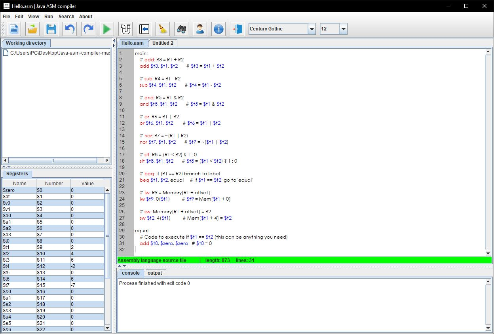
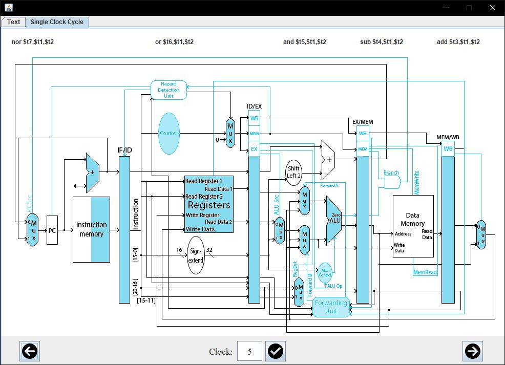
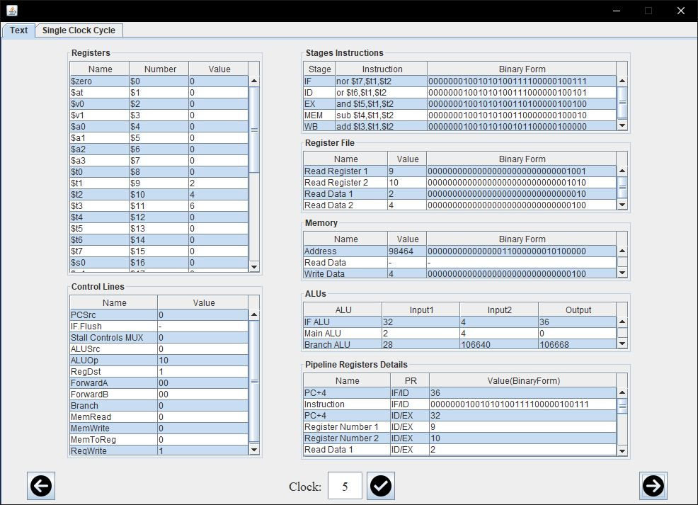

# A Graphical MIPS Assembler and Pipeline Simulator

###### This repository is our Computer Organization and Design course project that we had to create a MIPS pipeline simulator.

## About this project

<table>
  <tr>
    <td align="center">
      
      
Main Window

    </td>
    <td align="center">
      
      
Pipeline Simulator

    </td>
    <td align="center">
      
      
Pipeline Information

    </td>
  </tr>
</table>

Assembles and simulates 9 basic instructions (add, sub, and, or, nor, slt, beq, lw, sw) of the MIPS instruction set
Our guideline reference for implementing the instruction set was _Computer Organization and Design, Fifth Edition by Patterson and Hennessy_.

Implemented exceptions for the project are:

1. IllegalRegisterNumberException
2. SymbolNotFoundException (for labels)
3. UndefinedInstructionException (for unsupported instructions or wrong instructions)
4. UnformattedInstructionException

## How to use the program
Either
- [Download the artifact](https://github.com/amir-ni/Java-asm-compiler/releases/download/v1.0.0/Java-asm-compiler.jar) and open the program

Or
- Clone the code, import it to the IDE of your choice, and run the **JavaAsmCompiler.java** file to open the program.

Then

- Write your MIPS code, click on the run button; if console displayed successful compile, click on pipeline button to display the simulation.

## Custom features

We had to develop this editor & emulator with many custom features that I listed some of them below:

- Editor features:
- - Code color scheme
- - predefine register's values
- - User-friendly editor with common features
- Simulator features:
- - All details of CPU pipeline in text and graphical view
- - Single clock cycle diagram for CPU pipeline
- - Forwarding Unit: _Handles forwarding in execution stage_
- - Hazard detection unit in Instruction Detection (ID) stage: _Handles lw data hazard with nop and beq control hazard using 3 bubble technique_

## About MIPS

MIPS (Microprocessor without Interlocked Pipelined Stages) is a reduced instruction set computer (RISC) instruction set architecture (ISA) developed by MIPS Computer Systems (an American company that is now called MIPS Technologies).

## License

This project is open-source software licensed under the [MIT license](https://opensource.org/licenses/MIT).
